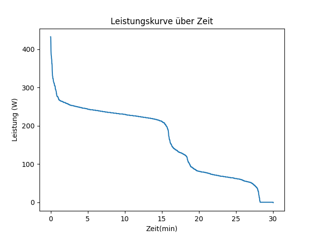

# programmieren_2_aufgabe_1
Übung 1 Programmierübung
Um den Code ausführen zu können, installieren sie UV im Browser. Dann müssen sie einen neuen Ordner für das Projekt erstellen und das Repository auf Github klonen (passenden Link kopieren). Im neuen Ordner öffnen sie ein Terminal und kopieren sie den Link vom geklonten Repository hinein. Dann initialisieren sie das Projekt indem Sie den Befehl „uv init“ im Terminal eingeben. Als nächstes muss man Numpy und Matplotlib importieren, über die Befehle uv add numpy und uv add Matplotlib. Nun kann man den Code in VS Code ausführen, nach den entsprechenden Bedürfnissen anpassen und die unten stehende Grafik erstellen und abspeichern :).
